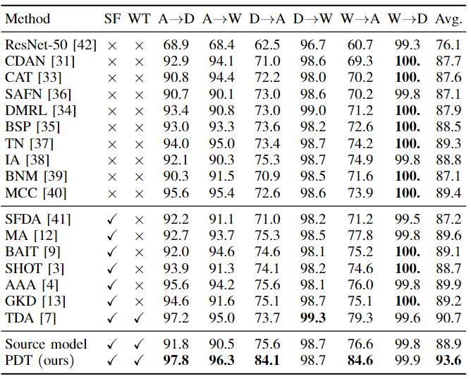

# PSAT-GDA

Code (pytorch) for ['Progressive Source-Aware Transformer for Generalized Source-Free Domain Adaptation']() on Digit, Office-31, Office-Home, VisDA-C. This paper has been accepted by IEEE Transactions on Multimedia (TMM).

### Preliminary

You need to download the [Office-31](https://drive.google.com/file/d/0B4IapRTv9pJ1WGZVd1VDMmhwdlE/view), [Office-Home](https://drive.google.com/file/d/0B81rNlvomiwed0V1YUxQdC1uOTg/view), [VisDA-C](https://github.com/VisionLearningGroup/taskcv-2017-public/tree/master/classification) dataset,  modify the path of images in each '.txt' under the folder './data/'.

The experiments are conducted on one GPU (NVIDIA RTX TITAN).

- python == 3.7.3
- pytorch ==1.6.0
- torchvision == 0.7.0
- numpy, scipy, sklearn, PIL, argparse, randaugment, torchsample

## Prepare pretrain model for VIT 
We choose R50-ViT-B_16 as our encoder.
```bash root transformerdepth
wget https://storage.googleapis.com/vit_models/imagenet21k/R50+ViT-B_16.npz 
mkdir ./model/vit_checkpoint/imagenet21k 
mv R50+ViT-B_16.npz ./model/vit_checkpoint/imagenet21k/R50+ViT-B_16.npz
```

### Training and evaluation

1. First training model on Office-31 dataset of single target is shown here.

   > ~/anaconda3/envs/vit_kd/bin/python target_PSAT-GDA.py --cls_par 0.6 --da uda --dset VISDA-C --gpu_id 0 --s 0 --t 1 --output_src ckpskdr2/source_tt_08/ --output ckpskdr2/target_PSAT-GDA_08_0112/ --lr 1e-3

2. Second training model on Office-31 dataset of multiple targets is shown here.

   > ~/anaconda3/envs/vit_kd/bin/python target_PSAT-GDA_cda_oc.py --cls_par 0.6 --da uda --dset office --gpu_id 0 --s 0 --t 1 --output ckpspdtcda/target_PSAT-GDAcda_0113/ --seed 2020;


**The results of PKMSM is display under the folder './PSAT-GDA/results/'.**



### Citation
@ARTICLE{tang2023psat,
  author={Tang, Song and Shi, Yuji and Song, Zihao and Ye, Mao and Zhang, Changshui and Zhang, Jianwei},
  journal={IEEE Transactions on Multimedia}, 
  title={Progressive Source-Aware Transformer for Generalized Source-Free Domain Adaptation}, 
  year={2023},
  volume={},
  number={},
  pages={1-14},
  doi={10.1109/TMM.2023.3321421}}

### Acknowledgement

The codes are based on [SHOT (ICML 2020, also source-free)](https://github.com/tim-learn/SHOT), [VIT](https://github.com/jeonsworld/ViT-pytorch)

### Contact

- tntechlab@hotmail.com


